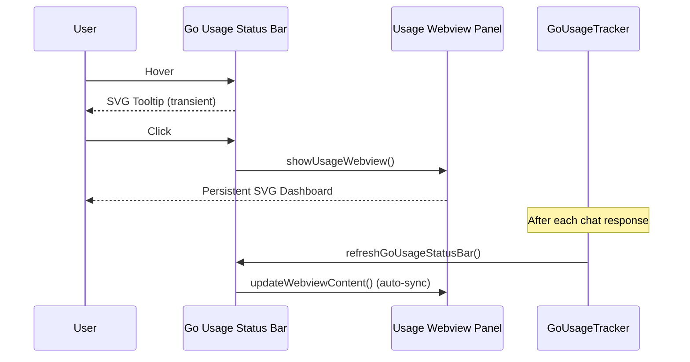

**Status:** ✅ Solved

# Usage Webview Panel — Persistent SVG Usage Dashboard

**Topic:** usage / status-bar / webview / ux
**Updated:** 2026-06-13
**Tags:** #usage #status-bar #webview #ux #vscode

---

## Overview

Implemented a persistent Webview panel for OpenCode Go usage details that stays open in the editor area, similar to how GitHub Copilot Chat shows quota information. Previously, usage data was only visible via a transient hover tooltip on the status bar icon — the tooltip disappeared as soon as the mouse moved away.

---

## Problem

The Go Usage Tracker status bar icon showed a rich SVG usage summary (session/weekly/monthly quotas, cost, tokens) only as a hover tooltip. This tooltip:

1. **Disappeared immediately** when the mouse left the status bar area
2. **Could not be interacted with** — no selection, no scrolling, no copy
3. **Was not discoverable** — users had to know to hover over the icon
4. **Contrasted with GitHub Copilot** — Copilot's usage/quota display stays visible after clicking

### Research Findings

Investigated multiple approaches to make the tooltip "sticky":

| Approach | Feasibility | Reason |
|----------|-------------|--------|
| `statusBarItem.showHover()` | ❌ Not available | VS Code API has no programmatic hover trigger for status bar items |
| `workbench.action.showHover` | ❌ Internal only | Only works for editor hovers, not status bar tooltips |
| Tooltip with `command` | ⚠️ Conflicts | Setting `command` on StatusBarItem prevents hover tooltip from appearing while mouse is over the item — VS Code shows the command action instead |
| **Webview Panel** | ✅ Best solution | Persistent, theme-aware, real-time updates, matches Copilot UX pattern |

**Key Finding:** GitHub Copilot itself uses a Webview/panel approach for showing quota details — not a sticky tooltip. The hover shows a brief summary, and clicking opens a persistent view.

---

## Solution

### Dual-Interaction Design

| Interaction | Behavior |
|-------------|----------|
| **Hover** over status bar icon | Shows tooltip with SVG usage summary (existing behavior preserved) |
| **Click** on status bar icon | Opens persistent Webview panel with the same SVG in `ViewColumn.Beside` |

### Architecture



---

## Changes

| # | Change | Files | Impact |
|---|--------|-------|--------|
| P0 | New `usageWebviewPanel` module variable | `src/extension.ts` | Tracks persistent panel lifecycle |
| P1 | Register `opencodego.showUsageDetails` command | `package.json`, `src/extension.ts` | New command entry point for click action |
| P2 | Assign command to status bar item | `src/extension.ts` | `goUsageStatusBarItem.command = "opencodego.showUsageDetails"` enables click |
| P3 | `showUsageWebview()` function | `src/extension.ts` | Creates or reveals Webview panel in `ViewColumn.Beside` |
| P4 | `updateWebviewContent()` function | `src/extension.ts` | Renders usage SVG inside themed HTML with CSS variables |
| P5 | Real-time sync in `refreshGoUsageStatusBar()` | `src/extension.ts` | Calls `updateWebviewContent()` after every usage refresh |
| P6 | Panel dispose handler | `src/extension.ts` | Cleans up `usageWebviewPanel` reference when user closes panel |
| P7 | Activation event + command contribution | `package.json` | `onCommand:opencodego.showUsageDetails` + command metadata |

### Files Changed

- `src/extension.ts` — Added `usageWebviewPanel`, `showUsageWebview()`, `updateWebviewContent()`, command registration, command assignment on status bar item, auto-sync in refresh
- `package.json` — New command `opencodego.showUsageDetails`, new activation event

---

## Implementation Details

### `showUsageWebview(context)`

- If panel already exists → `reveal()` to bring to front
- If not → `createWebviewPanel()` with `retainContextWhenHidden: true` for performance
- Registers `onDidDispose` handler to clean up module-level reference
- Calls `updateWebviewContent()` immediately after creation

### `updateWebviewContent()`

- Early return if no panel or no tracker
- Reuses existing `buildUsageTooltipSvg()` — same SVG as the hover tooltip
- Wraps SVG in themed HTML using VS Code CSS variables:
  - `var(--vscode-editor-background)` for body background
  - `var(--vscode-editor-foreground)` for text color
- SVG rendered at 100% width, max 480px, with subtle shadow and rounded corners

### Auto-Sync

`refreshGoUsageStatusBar()` now calls `updateWebviewContent()` at the end of every refresh cycle. This means:
- User sends chat → response arrives → usage recorded → status bar updated → **Webview also updated**
- No manual refresh needed

### Theme Integration

The Webview uses VS Code's native CSS variables for theming, ensuring consistent appearance across:
- Dark themes (default One Dark Pro, etc.)
- Light themes
- High contrast themes

The inner SVG retains its own `#1e1e1e` background since it contains its own color scheme.

---

## Verification

```bash
npm run compile
# Expected: clean compile, 0 errors

# Manual verification:
# 1. Open VS Code with extension loaded
# 2. Hover over Go usage status bar icon → tooltip appears
# 3. Click on Go usage status bar icon → Webview panel opens in side column
# 4. Send a chat message → verify Webview SVG updates automatically
# 5. Close panel → click icon again → panel reopens (not duplicated)
# 6. Switch theme → verify Webview respects new theme colors
```

---

## Future Enhancements

- Consider adding interactive elements to the Webview (e.g., cost breakdown chart, historical trends)
- Add Webview title icon for visual consistency with other VS Code panels
- Consider `vscode.window.registerWebviewViewProvider` for a sidebar view instead of editor panel
