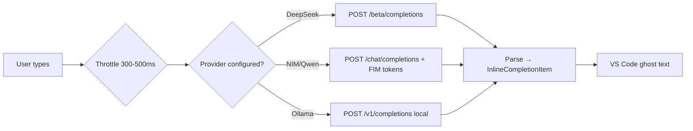

**Status:** 🔬 Research / Proposed

# Inline Code Suggestions (Ghost Text) — FIM Endpoint Research & Execution Options

**Topic:** inline-completions / fim / autocomplete / ghost-text / deepseek / qwen-coder / ollama / byok  
**Updated:** 2026-06-17  
**Tags:** #inline-completions #fim #autocomplete #ghost-text #deepseek #qwen-coder #ollama #byok #research #feature-request  
**GitHub Issue:** [#49](https://github.com/ltmoerdani/opencode-copilot-chat/issues/49) — *[FEATURE] Add inline code suggestions with selectable AI model (Copilot-like experience)*  
**Related Branch (external):** [`Wallacy/opencode-copilot-chat@feat/persistent-autocomplete`](https://github.com/Wallacy/opencode-copilot-chat/tree/feat/persistent-autocomplete)  
**Reporter (issue):** [@lorelore789](https://github.com/lorelore789)  
**Prior Art (comment):** [@Wallacy](https://github.com/Wallacy) — explored implementation, blocked on latency

---

## Overview

Issue #49 requests **inline code suggestions** (ghost text / Copilot-style autocomplete) directly inside the editor while the user types, with a setting to select the AI model that powers suggestions. Today the extension is chat-only, which breaks coding flow.

[@Wallacy](https://github.com/Wallacy) already built a working prototype on a fork using VS Code's `InlineCompletionItemProvider` API, but concluded it is **not viable on the OpenCode Go provider** because every Go model is reasoning-first and produces 400–700 hidden reasoning tokens before any visible output, pushing latency to 5–10 seconds.

This document captures fresh external research (2026-06-17) on:
1. Whether the OpenCode Go blocker is fundamental or solvable today.
2. Which providers/models/endpoints can realistically deliver a sub-2-second autocomplete experience.
3. A concrete, prioritized execution plan that does **not** depend on waiting for OpenCode to add a `/completions` endpoint.

---

## Problem Recap — Why OpenCode Go Cannot Power Autocomplete

Findings from the prototype branch, confirmed against current provider behavior:

| Symptom | Detail |
|---|---|
| Latency floor ~5–10s | All OpenCode Go models are reasoning-first. Even with `reasoning: false`, MiMo V2.5 and DeepSeek V4 Flash emit 400–700 hidden reasoning tokens before visible text. |
| TPS ceiling ~60 | At ~60 tokens/sec, even a small completion consumes 1–2s just for output, on top of reasoning time. |
| Fast models too costly | GLM, Kimi, Qwen via OpenCode Go are priced for agentic coding, not for高频 autocomplete calls. |
| No FIM endpoint | OpenCode exposes only `/chat/completions`. No `/completions` (FIM) endpoint, no `prefix` / `suffix` / `echo` / `logprobs`. Forces a "fake chat" prompt that is slower and less accurate than a dedicated FIM endpoint. |

**Conclusion:** The blocker is **intrinsic to the OpenCode Go ecosystem today**. The fastest path to a shippable feature is to source autocomplete from providers that (a) ship a non-reasoning code model and (b) expose a native FIM endpoint — independent of OpenCode Go.

---

## External Research Findings (2026-06-17)

### A. VS Code Inline Completion API

Confirmed via [VS Code API reference](https://code.visualstudio.com/api/references/vscode-api#InlineCompletionItemProvider):

- `vscode.languages.registerInlineCompletionItemProvider(selector, provider)` — stable, public API.
- `InlineCompletionItemProvider.provideInlineCompletionItems(document, position, context, token)` returns `InlineCompletionItem[]` or `InlineCompletionList`.
- `InlineCompletionItem(insertText, range?, command?)` — `insertText` may be a plain `string` or `SnippetString`.
- `InlineCompletionContext.triggerKind` ∈ `{ Invoke = 0, Automatic = 1 }`.
- VS Code handles rendering, debouncing, and `Tab` to accept; the extension only needs to produce candidates and respect the `CancellationToken`.

This is exactly the API the prototype branch targets; no proposed/unstable API is required.

### B. DeepSeek — Native FIM Endpoint (Beta)

Source: [api-docs.deepseek.com/api/create-completion](https://api-docs.deepseek.com/api/create-completion) · [pricing](https://api-docs.deepseek.com/quick_start/pricing) · [kv_cache](https://api-docs.deepseek.com/guides/kv_cache)

- **Endpoint:** `POST https://api.deepseek.com/beta/completions` (must use `/beta` base URL).
- **Supported model:** `deepseek-v4-pro` (FIM supported in **non-thinking mode only**).
- **FIM-native parameters:** `prompt` (prefix) and `suffix` — plus `echo`, `logprobs` (≤20), `max_tokens`, `stop`, `stream`, `stream_options`, `temperature`, `top_p`.
- **Non-thinking mode = no hidden reasoning tokens** → directly solves the OpenCode Go blocker.
- **Context caching (disk, on by default):** common prefixes (file header, imports, class signature) are persisted and reused, surfacing via `usage.prompt_cache_hit_tokens` / `prompt_cache_miss_tokens`. For autocomplete, repeated prefix reuse should yield frequent cache hits.

**Pricing (per 1M tokens, USD):**

| Model | Input cache hit | Input cache miss | Output |
|---|---|---|---|
| `deepseek-v4-flash` | **$0.0028** | $0.14 | $0.28 |
| `deepseek-v4-pro` | $0.003625 | $0.435 | $0.87 |

- Concurrency limit: `deepseek-v4-flash` = **2500 RPM**, `deepseek-v4-pro` = 500 RPM.

> ⚠️ **Naming note (deprecation 2026-07-24):** `deepseek-chat` and `deepseek-reasoner` map to the non-thinking and thinking modes of `deepseek-v4-flash`. For autocomplete use **`deepseek-v4-flash`** (non-thinking default), **not** `deepseek-chat`.

**Why this is the strongest candidate:** cheapest cache-hit pricing of any candidate, native FIM endpoint, non-reasoning, 2500 RPM headroom, OpenAI-compatible SDK plumbing.

### C. Qwen3-Coder — Native FIM via Special Tokens

Source: [QwenLM/Qwen3-Coder](https://github.com/QwenLM/Qwen3-Coder) · [Aliyun DashScope](https://help.aliyun.com/zh/model-studio/developer-reference/use-qwen-by-calling-api)

- All Qwen3-Coder variants (480B-A35B, 30B-A3B, Next) **support FIM natively** using special tokens:
  ```
  <|fim_prefix|>{prefix}<|fim_suffix|>{suffix}<|fim_middle|>
  ```
- **Qwen3-Coder-Next is non-thinking by design** — per the official README: *"This model supports only non-thinking mode and does not generate `<think></think>` blocks."* Ideal for autocomplete.
- Hosting options relevant to this repo (per existing user memory):
  - **NVIDIA NIM** (`https://integrate.api.nvidia.com/v1`) — `qwen3-coder-480b` exposed via OpenAI-compatible `/chat/completions`, API key already provisioned.
  - **Cerebras** — Qwen3-Coder-480B at ~2000+ TPS (API key not yet provisioned).
  - **DashScope (Aliyun)** — native Qwen3-Coder host.
- **Caveat:** NIM and DashScope generally expose `/chat/completions` only, so FIM is achieved via the special-token prompt pattern rather than a dedicated `/completions` endpoint — slightly less efficient than DeepSeek's native FIM endpoint, but the model is non-thinking so latency stays low.

### D. Local Model via Ollama — Zero-Cost Fallback

- Ollama exposes a native OpenAI-compatible `/v1/completions` endpoint that **does** support `prompt` + `suffix` (FIM).
- Small coder models suitable for inline completion: `qwen3-coder:1.7b`, `qwen2.5-coder:1.5b`, `deepseek-coder:1.3b`.
- Local inference latency: ~100–300ms for short completions on consumer hardware.
- Zero API cost, fully offline — ideal as a default fallback or privacy-conscious default.

---

## Execution Plan — Prioritized Options

| Priority | Option | Effort | Expected latency | Cost profile | Notes |
|---|---|---|---|---|---|
| 🥇 P0 | **DeepSeek FIM Beta** (`/beta/completions`, non-thinking) | Small | 1–2s | $0.0028/1M cache hit — cheapest | Production-ready now; BYOK DeepSeek key |
| 🥈 P1 | **Qwen3-Coder via NVIDIA NIM** (special-token FIM) | Small | 1.5–3s | Pay-per-use NIM | API key already provisioned in user memory; non-thinking model |
| 🥉 P2 | **Ollama local** fallback | Medium | 0.1–0.3s | Free, offline | For users without an API key; privacy default |
| ⛔ Skip | OpenCode Go models for autocomplete | — | 5–10s | Reasoning-first | Intrinsic blocker; revisit only if OpenCode ships `/completions` + non-reasoning model |

### Recommended Architecture



### Proposed Configuration Surface

Settings contributed via `package.json` `contributes.configuration`:

```jsonc
{
  "oaicopilot.autocomplete.enabled": {
    "type": "boolean",
    "default": false,
    "description": "Enable inline code suggestions (ghost text)."
  },
  "oaicopilot.autocomplete.provider": {
    "type": "string",
    "enum": ["deepseek-fim", "qwen-nim", "ollama-local", "custom"],
    "default": "deepseek-fim",
    "description": "Backend used for inline completions. Operates independently of the chat provider."
  },
  "oaicopilot.autocomplete.model": {
    "type": "string",
    "default": "deepseek-v4-flash",
    "description": "Model id for the selected autocomplete provider."
  },
  "oaicopilot.autocomplete.apiKey": {
    "type": "string",
    "default": "{env:DEEPSEEK_API_KEY}",
    "description": "API key for the autocomplete provider. Independent from the chat key."
  },
  "oaicopilot.autocomplete.baseUrl": {
    "type": "string",
    "default": "https://api.deepseek.com/beta",
    "description": "Base URL for FIM requests."
  },
  "oaicopilot.autocomplete.throttleMs": {
    "type": "number",
    "default": 300,
    "minimum": 0,
    "description": "Debounce window between keystroke and request."
  },
  "oaicopilot.autocomplete.maxTokens": {
    "type": "number",
    "default": 64,
    "maximum": 256,
    "description": "Maximum tokens to generate per completion."
  },
  "oaicopilot.autocomplete.contextLinesBefore": {
    "type": "number",
    "default": 20,
    "description": "Lines of context sent as FIM prefix."
  },
  "oaicopilot.autocomplete.contextCharsAfter": {
    "type": "number",
    "default": 300,
    "description": "Characters of context sent as FIM suffix."
  }
}
```

### Implementation Touch Points (estimate, not committed)

| File | Change |
|---|---|
| `src/autocomplete/types.ts` | New — request/response + provider interface |
| `src/autocomplete/provider.ts` | New — DeepSeek FIM, Qwen-NIM, Ollama adapters |
| `src/autocomplete/throttle.ts` | New — debounce + shared `AbortController` (cf. Wallacy prototype) |
| `src/autocomplete/index.ts` | New — registers `InlineCompletionItemProvider`, wires settings |
| `src/extension.ts` | Conditionally activate autocomplete when `autocomplete.enabled` |
| `package.json` | Add `contributes.configuration` above; no new `activationEvents` (lazy via setting) |

This deliberately mirrors the file layout of the prototype branch so prior learnings (500ms throttle, shared `AbortController`, minimal system prompt) carry over.

---

## Decision Matrix — Why DeepSeek FIM Is P0

| Criterion | DeepSeek FIM | Qwen-NIM | Ollama local | OpenCode Go |
|---|---|---|---|---|
| Latency | 🟢 1–2s | 🟡 1.5–3s | 🟢 0.1–0.3s | 🔴 5–10s |
| Cost (cache hit) | 🟢 $0.0028/1M | 🟡 NIM per-use | 🟢 Free | 🔴 Per-use, reasoning overhead |
| Non-reasoning native | 🟢 Yes | 🟢 Yes (Coder-Next) | 🟢 Configurable | 🔴 No |
| Dedicated FIM endpoint | 🟢 `/beta/completions` | 🔴 `/chat/completions` only | 🟢 `/v1/completions` | 🔴 No |
| API key availability | 🟡 BYOK needed | 🟢 Already provisioned | 🟢 N/A | 🟢 Existing |
| Offline / privacy | 🔴 No | 🔴 No | 🟢 Yes | 🔴 No |
| Setup friction | 🟡 Add DeepSeek key | 🟢 Reuse NIM key | 🟡 Local install | 🟢 None |

DeepSeek FIM wins on the metrics that matter most for a first shippable cut (latency, cost, native FIM, non-reasoning). Ollama is the recommended **default fallback** so the feature is usable without any API key at all.

---

## Open Questions

1. Should autocomplete be **on-by-default** when an autocomplete API key is detected, or remain opt-in to avoid surprise network calls while typing?
2. Do we want a **hybrid tiered mode** (local for short context, cloud for longer context), or keep one provider per session for predictability?
3. Cerebras (Qwen3-Coder-480B @ ~2000 TPS) is the single fastest option — worth provisioning an API key and adding a `cerebras` provider?
4. Should the DeepSeek FIM adapter reuse this repo's existing `routing.ts` / `streaming.ts` plumbing, or stay fully isolated to avoid coupling to the chat codepath?

---

## Next Steps (awaiting decision)

- [ ] Pick P0 (DeepSeek FIM) vs P0 (Ollama-only) as the first cut.
- [ ] Draft reply to Issue #49 summarizing this research (per repo Draft Reply Protocol — show draft before posting).
- [ ] Prototype the DeepSeek FIM adapter as a draft PR against this repo.
- [ ] Record pricing/endpoint facts into repo memory once verified end-to-end.

---

## References

- VS Code API — `InlineCompletionItemProvider`: https://code.visualstudio.com/api/references/vscode-api#InlineCompletionItemProvider
- DeepSeek FIM (Beta): https://api-docs.deepseek.com/api/create-completion
- DeepSeek pricing: https://api-docs.deepseek.com/quick_start/pricing
- DeepSeek context caching: https://api-docs.deepseek.com/guides/kv_cache
- Qwen3-Coder (FIM special tokens, non-thinking Next): https://github.com/QwenLM/Qwen3-Coder
- Aliyun DashScope text-generation API: https://help.aliyun.com/zh/model-studio/developer-reference/use-qwen-by-calling-api
- OpenCode provider docs: https://opencode.ai/docs/providers
- Prototype branch (prior art): https://github.com/Wallacy/opencode-copilot-chat/tree/feat/persistent-autocomplete
